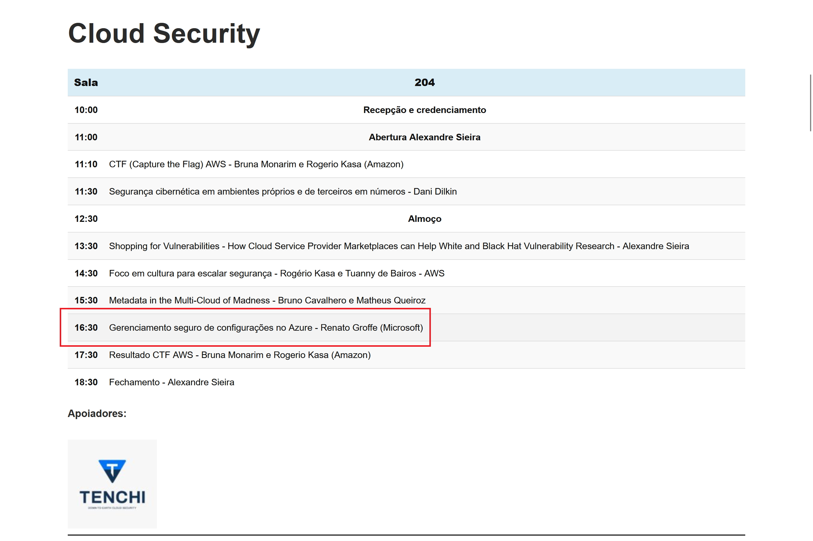
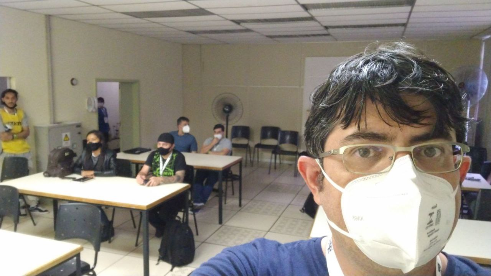

# Talk-GerenciamentoConfiguracoes-BSidesSP2022
Informações (fotos + prints + slides + repositório) sobre a apresentação que realizei no dia, durante a **17a edição** da **Security BSides São Paulo (BSidesSP)**, uma conferência sobre Segurança da Informação e Cultura Hacker que aconteceu em **São Paulo-SP** no dia **20/11/2022 (domingo)**.

Título da Apresentação: **Gerenciamento seguro de configurações no Azure**

Tecnologias utilizadas: **Azure App Configuration**, **Azure Key Vault**, **Azure App Service**, **Application Insights**, **.NET 7**, **ASP.NET Core**, **Visual Studio Code**

Número de participantes: **10 pessoas**

Repositório utilizado: [**link**](https://github.com/renatogroffe/ASPNETCore7-REST_API-AzureAppConfiguration-KeyVault_ContagemAcessos)

Local: **PUC-SP (Campus Consolação) - Rua Marquês de Paranaguá, 111 - Consolação - São Paulo-SP - CEP: 01303-050**

Site do evento: [**link**](https://securitybsides.com.br/2022/atividades/)

Formulário utilizado para inscrições: [**Eventbrite**](https://www.eventbrite.com/e/bsidessp-2022-registration-461598863627)

Deixo aqui meus agradecimentos à **Monica Yoshida** e ao **Alexandre Sieira (Tenchi Security)** por todo o apoio para que eu partipasse como palestrasse do **BSidesSP 2022**.

